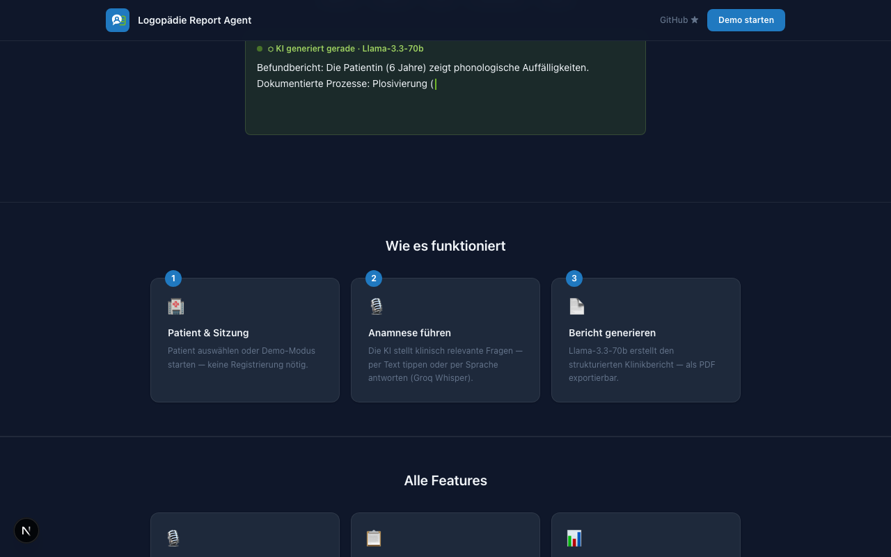

# Logopädie Report Agent

> AI-powered clinical documentation for speech therapists — guided anamnesis, automatic report generation, therapy plans, SOAP notes, and phonological analysis.

[](https://github.com/ucarsinan/logopaedie-report-agent/actions/workflows/ci.yml)


**[Live Demo →](https://logopaedie-report-agent.vercel.app/)**

---

## What This Is

Speech therapists spend a significant part of their day writing structured clinical reports. This tool automates that workflow: the therapist speaks or types, an AI guides the anamnesis interview, and a formatted report is generated in seconds.

Built as a portfolio project to demonstrate **production-grade AI integration** (Groq Whisper + Llama), **DSGVO-aware data architecture** (Fernet encryption, soft-delete, consent tracking), and a **complete multi-user auth system** (JWT + TOTP 2FA, session management, audit log) — all deployed as a monorepo on Vercel.



---

## Features

- **Guided Anamnesis** — AI-led interview collecting patient data step by step (text or voice)
- **Report Generation** — Befundbericht, Therapiebericht (kurz/lang), Abschlussbericht
- **Therapy Plans** — ICF-based planning with phases, goals, and milestones
- **SOAP Notes** — Structured clinical documentation
- **Phonological Analysis** — Audio or text-based phonological process detection
- **Report Comparison** — Side-by-side diff of two reports
- **PDF Export** — Formatted PDFs via ReportLab
- **Patient Management** — Persistent patient profiles with encrypted PII, cross-session history
- **Session History** — Paginated report archive with patient filter
- **Multi-user Auth** — Registration, email verification, TOTP 2FA, password reset, active sessions, admin audit log

---

## Tech Stack

| Layer | Technology |
| --- | --- |
| Frontend | Next.js 16, React 19, Tailwind CSS v4, TypeScript |
| Backend | FastAPI, Python 3.12, Pydantic v2, SQLModel, Alembic |
| AI | Groq API — Whisper large-v3 (STT) + Llama-3.3-70b (NLP) |
| Persistence | Upstash Redis (sessions, Fernet-encrypted) · Neon PostgreSQL (reports, patients) |
| Auth | JWT (HS256) + TOTP (PyOTP) + Resend (transactional email) |
| CI/CD | GitHub Actions (6 parallel jobs: lint, typecheck, test — backend + frontend) |
| Deploy | Vercel Services (monorepo: Next.js frontend + FastAPI backend) |

---

## Architecture

```text
Browser (React 19)
  ├─► POST /sessions              → create session (Redis, Fernet-encrypted)
  ├─► POST /sessions/{id}/chat    → guided anamnesis (text)
  ├─► POST /sessions/{id}/audio   → guided anamnesis (voice → Whisper → chat)
  ├─► POST /sessions/{id}/upload  → attach materials (PDF, DOCX, TXT)
  ├─► POST /sessions/{id}/generate → generate report (→ Neon PostgreSQL)
  ├─► POST /sessions/{id}/therapy-plan
  ├─► POST /sessions/{id}/soap
  ├─► POST /analysis/phonological
  ├─► GET  /reports               → paginated history (patient-scoped per user)
  └─► GET  /reports/{id}/pdf      → PDF download (ReportLab)
```

```text
backend/
├── main.py              # FastAPI app + exception handlers
├── routers/             # 9 APIRouter modules
├── services/            # 11 business logic services
├── models/              # Pydantic schemas + SQLModel tables
├── middleware/          # JWT auth + rate limiting (slowapi + Redis)
└── tests/               # 157 pytest tests

frontend/src/
├── features/            # 9 feature modules (chat, report, phonology, patients, ...)
├── components/          # Shared UI components
├── providers/           # SessionProvider, ThemeProvider, AuthProvider
├── hooks/               # Custom hooks
├── types/               # Centralized TypeScript types
└── lib/api.ts           # API client (20+ endpoints)
```

---

## Design Decisions

**Fernet encryption for session state in Redis**
Session data (patient PII, conversation history) is encrypted at rest using Fernet before being written to Upstash Redis. The key is injected via `SESSION_ENCRYPTION_KEY` env var — Upstash never sees plaintext.

**JWT `sid` = refresh token hash**
The JWT access token carries a `sid` claim equal to the SHA-256 hash of the current refresh token. This enables the backend to determine `is_current_session` in the active sessions list without a database lookup per request.

**Dual-store split (Redis ephemeral / Neon persistent)**
Active sessions live in Redis with a 24h TTL — fast, auto-expiring, no cleanup needed. Generated reports and patient profiles land in Neon PostgreSQL for long-term persistence and cross-session queries. The two stores are never mixed.

---

## Local Setup

### Prerequisites

- Node.js 22+
- Python 3.12+
- [Groq API key](https://console.groq.com/keys) (free tier available)

### 1. Clone & install

```bash
git clone https://github.com/ucarsinan/logopaedie-report-agent.git
cd logopaedie-report-agent

# Backend
cd backend && pip install -r requirements.txt -r requirements-dev.txt

# Frontend
cd ../frontend && npm install
```

### 2. Configure environment

```bash
cp .env.example .env
# Required: GROQ_API_KEY
# Optional: KV_REST_API_URL, KV_REST_API_TOKEN (Upstash Redis)
#           DATABASE_URL (Neon PostgreSQL)
#           JWT_SECRET, SESSION_ENCRYPTION_KEY, RESEND_API_KEY (for auth)
```

### 3. Run

```bash
# Both services in parallel (recommended)
./dev.sh

# Or individually:
# Terminal 1 — Backend  (http://localhost:8001)
cd backend && uvicorn backend.main:app --reload --port 8001

# Terminal 2 — Frontend (http://localhost:3000)
cd frontend && npm run dev
```

### 4. Tests

```bash
cd backend && python -m pytest          # 157 backend tests
cd frontend && npm test                  # 59 frontend tests
```

---

## Authentication

Full multi-user auth: email + password registration, email verification, optional TOTP 2FA, password reset, active sessions dashboard with per-device revoke, and an admin audit log.

### Environment variables

| Variable | Description |
| --- | --- |
| `GROQ_API_KEY` | [Groq](https://console.groq.com/keys) API key (STT + NLP) |
| `JWT_SECRET` | HS256 signing secret for access tokens |
| `SERVICE_TOKEN` | Internal service-to-service bearer token |
| `SESSION_ENCRYPTION_KEY` | Fernet key for session data at rest |
| `RESEND_API_KEY` | [Resend](https://resend.com) API key for transactional email |
| `RESEND_FROM_EMAIL` | Sender address (e.g. `noreply@example.com`) |
| `DATABASE_URL` | Neon PostgreSQL connection string |
| `KV_REST_API_URL` | Upstash Redis REST URL |
| `KV_REST_API_TOKEN` | Upstash Redis REST token |
| `BACKEND_URL` | Backend URL as seen from the frontend proxy (locally `http://localhost:8001`) |

> **Email:** Resend requires one-time domain verification at [resend.com/domains](https://resend.com/domains) before sending from a custom address.

---

## Deployment (Vercel)

Deployed as a monorepo using [Vercel Services](https://vercel.com/docs/services) — Next.js frontend and FastAPI backend as separate services in a single `vercel.json`.

```bash
vercel deploy
```

### Deploy checklist

1. Set all env vars listed above in the **backend** service environment.
2. Set `BACKEND_URL` in the **frontend** service environment (use the Vercel-generated backend service URL).
3. Run Alembic migrations: `alembic upgrade head`.
4. Smoke-test: register → verify email → login → enable 2FA → login with 2FA code.

---

## License

MIT
