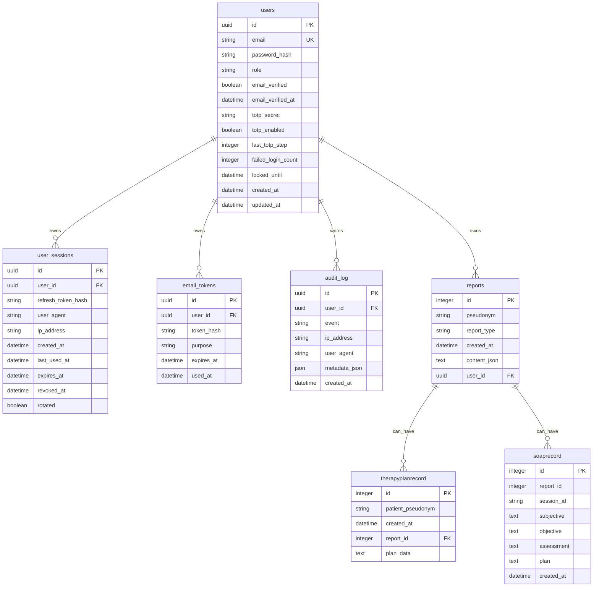

# MVP-PDF-Daten - Logopädie Report Agent

Stand: 2026-05-03

Quelle: `AI Engineering - Sinan Ucar 2639418319f38286bf75810995eb31e5.pdf`

## 1. Direkt benötigte PDF-Felder

| PDF-Feld | Ermittelte Daten aus dem Projekt | Status |
|---|---|---|
| Start Datum | Nicht im Projekt hinterlegt. Muss aus Weiterbildung/Projektplan ergänzt werden. | Offen |
| MVP Ende Datum | Nicht im Projekt hinterlegt. Muss aus Weiterbildung/Projektplan ergänzt werden. | Offen |
| Mentorship Ende Datum | Nicht im Projekt hinterlegt. Muss aus Weiterbildung/Projektplan ergänzt werden. | Offen |
| Projekt Idee | AI-gestütztes Tool für Logopäden: Ein geführtes Anamnesegespräch sammelt Patientendaten per Text oder Audio, verarbeitet optionale Materialien und generiert strukturierte logopädische Berichte. Zusätzlich bietet das MVP Therapiepläne, SOAP-Notizen, phonologische Analyse, Berichtsvergleich, Textvorschläge, PDF-Export und Verlaufssuche. | Vorhanden |
| Github repo | `https://github.com/ucarsinan/logopaedie-report-agent.git` | Vorhanden |
| Datenbank-Schema | Siehe Abschnitt 3. Für die PDF sollte daraus ein Screenshot/ERD erstellt werden. | Vorhanden, Screenshot offen |
| Vergleichstabelle | Siehe Abschnitt 4. Eine echte Vergleichstabelle mit Testoutputs/Kosten kann daraus finalisiert werden. | Teilweise vorhanden |
| Projekt Video | Nicht im Projekt hinterlegt. Benötigt 3-5 Minuten Demo-Recording. | Offen |
| Projekt Präsentation | Nicht im Projekt hinterlegt. Benötigt 3-5 Folien. | Offen |
| Screenshots | Noch keine dedizierten Screenshots im Repo. Geeignete Screens: Berichterstellung, Upload, Chat, Vorschau, Verlauf, Therapieplan, Phonologie, SOAP. | Offen |

## 2. Projektbeschreibung für die PDF

Der Logopädie Report Agent ist ein AI-gestützter Dokumentationsassistent für logopädische Therapiesitzungen. Therapeut:innen führen ein strukturiertes Anamnesegespräch per Text oder Audio, können vorhandene Unterlagen hochladen und erhalten daraus professionelle, fachsprachliche Berichte in verschiedenen Berichtstypen.

Das MVP geht über einen einfachen ChatGPT-Wrapper hinaus: Es verwaltet verschlüsselte Session-Zustände in Redis, speichert generierte Berichte nutzerbezogen in PostgreSQL, erzwingt strukturierte JSON-Ausgaben, bietet Authentifizierung und stellt mehrere fachliche GenAI-Workflows bereit.

Kernfunktionen:

- Geführte Anamnese per Textchat
- Audio-Input mit Whisper-Transkription
- Material-Upload für PDF, DOCX und TXT
- Strukturierte Berichtsgenerierung für Befundbericht, Therapiebericht kurz/lang und Abschlussbericht
- Persistenz von Berichten in PostgreSQL/Neon
- Therapieplan-Generator
- SOAP-Notizen
- Phonologische Analyse aus Audio oder Wortpaaren
- Berichtsvergleich
- Textvorschläge für Berichtsteile
- PDF-Export
- Login, Registrierung, E-Mail-Verifikation, 2FA, Passwort-Reset, aktive Sessions und Audit-Log

## 3. Datenbank-Schema

Source of truth aus Code/Migrations:

Wichtiger Hinweis für die Abgabe: Die lokale Datei `reports.db` ist nicht auf dem Stand der aktuellen SQLModel-/Alembic-Struktur. Sie enthält nur `reportrecord`, `therapyplanrecord` und `soaprecord`; die aktuelle Code-Struktur nutzt dagegen `reports` plus Auth-Tabellen. Für den PDF-Screenshot sollte daher das Schema aus den Modellen/Migrations oder eine frisch migrierte DB verwendet werden.

## 4. Vergleichstabelle für die PDF

| Vergleichspunkt | Umsetzung im Projekt | Prompt/Output | Kosten/Notes | Status |
|---|---|---|---|---|
| Speech-to-Text | Groq `whisper-large-v3` für Audio-Chat und Legacy-Transkription | Audio wird zu Transkript, danach in den Anamnese-Flow übergeben | Groq statt OpenAI; genaue Kosten müssen aus Groq-Konsole/API-Doku ergänzt werden | Implementiert |
| Guided Anamnesis | Groq Chat Completion mit Modellrotation: `llama-3.1-8b-instant`, `gemma2-9b-it`, `llama3-8b-8192` | Gesprächsantworten plus strukturierte Extraktion der fehlenden Felder | Temperatur 0.3, Fallback bei Rate-Limits/decommissioned models | Implementiert |
| Strukturierte Berichtsgenerierung | Groq JSON Completion mit `llama-3.3-70b-versatile`, Fallback auf weitere 70b-Modelle | Strikte JSON-Strukturen pro Berichtstyp | Temperatur 0, DB-Speicherung in `reports.content_json` | Implementiert |
| Prompt-Technik: rollenbasierter Fachprompt | Systemprompt als logopädischer Fachassistent mit SGB-V-, ICF- und Pseudonymisierungsregeln | Fachsprachliche deutsche Berichte | Gute MVP-Differenzierung, weil Fachdomäne stark eingebunden ist | Implementiert |
| Prompt-Technik: report-type-specific JSON | Eigene Prompt-Templates für Befundbericht, Therapiebericht kurz/lang und Abschlussbericht | Unterschiedliche JSON-Felder je Berichtstyp | Zeigt strukturierte Outputs statt Freitext | Implementiert |
| Prompt-Technik: Kontext aus Uploads | PDF/DOCX/TXT-Materialien werden extrahiert und in den Prompt aufgenommen | Bericht kann vorhandene Unterlagen berücksichtigen | Kein Embedding/RAG; Kontext wird direkt eingebunden | Teilweise implementiert |
| RAG/VectorDB | Nicht vorhanden | Kein Chunking, keine Embeddings, keine Similarity Search | Die PDF listet RAG als optionales Thema Woche 6-7; aktuell ist es eine Lücke, falls verlangt | Offen |
| Multi-Provider-Vergleich | Nur Groq ist produktiv angebunden | Kein echter OpenAI/Gemini-Vergleich im Code | Für die Vergleichstabelle können stattdessen Prompt-Varianten verglichen werden; echte Output-/Kostenwerte fehlen noch | Offen/Teilweise |

## 5. Mapping auf den PDF-Zeitplan

| PDF-Woche | Aufgabe | Projektstatus |
|---|---|---|
| Woche 1 | Projektidee formulieren | Erfüllt: Projektidee und README vorhanden |
| Woche 1 | GitHub Repository | Erfüllt: Remote `https://github.com/ucarsinan/logopaedie-report-agent.git` |
| Woche 1 | `.env` für sensible Daten | Erfüllt: `.env.example`, `.env`, `.env.local` vorhanden; README beschreibt Env-Vars |
| Woche 2 | DB-Schema erster Draft | Erfüllt: SQLModel-Modelle und Alembic-Migrations vorhanden; Screenshot noch zu erstellen |
| Woche 2 | Liste benötigter Endpunkte | Erfüllt: Routenstruktur mit Sessions, Reports, Analysis, Therapy Plans, SOAP, Suggest, Auth |
| Woche 2 | Initial Backend Infrastructure | Erfüllt: FastAPI-App, Router, Middleware, Exception Handler, DB Dependency |
| Woche 2 | Initial DB Setup | Erfüllt: SQLModel Engine, SQLite-Fallback, Neon/Postgres-Unterstützung, Alembic |
| Woche 2 | CRUD Endpoints | Erfüllt: Reports, Therapy Plans, Sessions/Auth; klassische CRUD-Struktur ist vorhanden |
| Woche 3 | Textgeneration Endpoint | Erfüllt: `/sessions/{id}/generate`, `/suggest`, Therapy Plan, SOAP, Compare |
| Woche 3 | System/User Prompt iterieren | Erfüllt: spezialisierte Fachprompts in mehreren Services |
| Woche 3 | Structured Output | Erfüllt: JSON Completion und Pydantic-Validierung/Schemas |
| Woche 3 | Output in DB speichern | Erfüllt: Reports und Therapy Plans werden persistiert; SOAP ebenfalls |
| Woche 4-5 | Temperature/max tokens testen | Teilweise: Temperatur ist gesetzt; dokumentierte Experimente fehlen |
| Woche 4-5 | Unterschiedliche Prompt-Techniken testen | Teilweise: verschiedene Promptarten im Code; explizite Vergleichsdokumentation fehlt |
| Woche 4-5 | Vergleichstabelle | Teilweise: Datenbasis vorhanden, reale Output-/Kosten-Tabelle fehlt |
| Woche 6-7 | RAG lernen/implementieren | Offen: Upload-Kontext vorhanden, aber keine VectorDB/Embeddings/Similarity Search |
| Woche 6-7 | Weitere Clients/Gemini/OpenAI/Groq | Teilweise: Groq produktiv; weitere Provider nicht angebunden |
| Woche 6-7 | Frontend | Erfüllt: Next.js-Frontend mit sieben Fachmodulen |
| Woche 6-7 | Deployment | Erfüllt/nahe dran: Vercel Services in `vercel.json`; Live-URL muss ergänzt werden |
| Woche 8 | Repo clean up | Teilweise: README/CI/Tests vorhanden; lokale DB-Schema-Abweichung prüfen |
| Woche 8 | README erstellen/verfeinern | Erfüllt: README vorhanden |
| Woche 8 | 3-5 Slides | Offen |
| Woche 8 | 3-5 Minuten Video | Offen |
| Woche 8 | Präsentation | Offen |

## 6. Belege aus dem Projekt

- README beschreibt Projektidee, Features, Tech Stack und Architektur.
- Backend nutzt FastAPI-Router für Sessions, Reports, Analysis, Therapy Plans, Suggestions, Exports, SOAP, Auth und Legacy.
- AI-Client nutzt Groq für Whisper und Llama-Modelle mit Fallback-Logik.
- Berichtsgenerator erzwingt report-type-spezifische JSON-Ausgaben.
- Session-State liegt in Upstash Redis mit optionaler Fernet-Verschlüsselung und 24h TTL.
- Persistenz liegt in SQLModel-Tabellen für User/Auth, Reports, SOAP und Therapy Plans.
- Frontend bietet Module für Berichterstellung, Ausspracheanalyse, Therapieplan, Berichtsvergleich, Textbausteine, Bericht-Verlauf und SOAP.
- CI enthält getrennte Jobs für Backend-Lint, Backend-Typecheck, Backend-Tests, Frontend-Lint, Frontend-Build und Frontend-Tests.

## 7. Offene Daten, die nicht aus dem Projekt ableitbar sind

- Startdatum der Weiterbildung/MVP-Phase
- MVP-Enddatum
- Mentorship-Enddatum
- Finale Deployment-/Vercel-URL
- Echte Vergleichswerte: Prompt, Output, Kosten und Notizen aus mindestens 2-3 Testläufen
- Screenshot des Datenbank-Schemas
- App-Screenshots für die PDF
- 3-5 Folien Präsentation
- 3-5 Minuten Projektvideo
